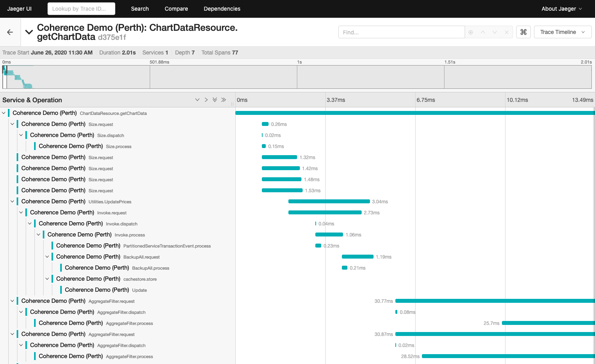
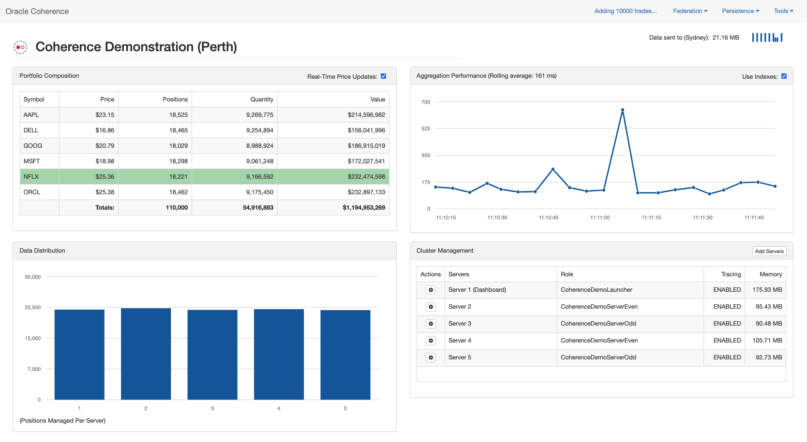
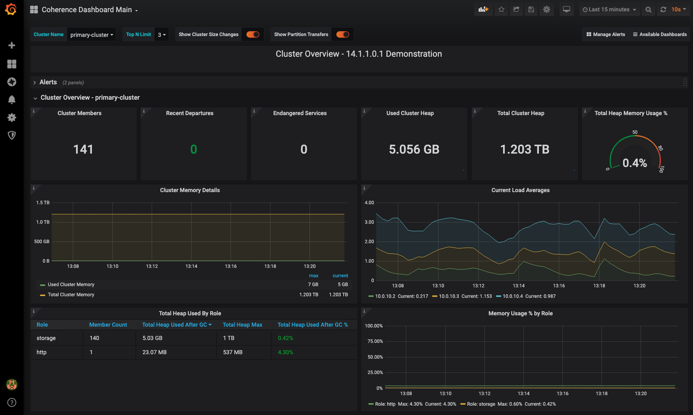

# Oracle Coherence Demonstration Application


  

## Overview

This document describes how to build and run the Coherence Demonstration application.
The application showcases Coherence general features, scalability capabilities including:

* Clustering and Data Sharding
* Scalability and High Availability
* Disk-Based Persistence
* Parallel Queries
* Efficient Aggregation
* In-Place Processing
* Federation (Grid Edition feature only)
* Lambda Support
* OpenTracing Support
* Polyglot client access from JavaScript, Python and Golang
* Listening for events using Server Sent Events (SSE)

You can run the application locally using `mvn exec:exec` or run on Kubernetes using the Coherence Operator. See the table
of contents below for instructions.

The demonstration uses AngularJS 1.7.5, Bootstrap 3.3.4, and a number of other frameworks. The UI interacts with Coherence using the REST API.

> Note: By default, this demonstration uses the [Coherence Community Edition](https://github.com/oracle/coherence) version 24.09 and
> as a consequence the commercial-only feature "Federation" is not available by default.
>
> Please see  [here](#run-the-demonstration-using-coherence-grid-edition) if you wish to enable Federation by running using Coherence Grid Edition.
>
> This version has been updated to move from `javax` -> `jakarta` packages and as such
> if you wish to run this demo against a previous CE or Grid Edition version, you must use `git checkout v5.0.1` to checkout a release of the demo that works with this version.

## Table of Contents

- Oracle Coherence Demonstration Application
  * [Overview](#overview)
  * [Table of Contents](#table-of-contents)
  * [Prerequisites](#prerequisites)
    + [General Prerequisites](#general-prerequisites)
    + [OpenTracing Prerequisites](#openTracing-prerequisites)
  * [Run the Application Locally](#run-the-application-locally)
      - [Modify the Defaults](#modify-the-defaults)
  - [Run the Polyglot clients](clients/README.md)
  * [Run the Application on Kubernetes](#run-the-application-on-kubernetes)
  * [Enable Federation on Kubernetes (Grid Edition Only)](#enable-federation-on-kubernetes-grid-edition-only)
  * [Run the Demonstration using Coherence Grid Edition](#run-the-demonstration-using-coherence-grid-edition)
  * [View Cluster Metrics via Grafana](#view-cluster-metrics-via-grafana)
  * [References](#references)

## Prerequisites

### General Prerequisites

To run the demonstration application, you must have the following software installed:

1. Java 21 SE Development Kit or Runtime environment.

   You can download JDK 21 from [Java SE Development Kit Downloads](https://www.oracle.com/java/technologies/downloads/)

2. Maven 3.6.0 or later version installed and configured.

3. Use a web browser that supports AngularJS to run the application. The following browsers are supported:
   * Safari, Chrome, Firefox, Opera 15, IE9 and mobile browsers (Android, Chrome Mobile, iOS Safari).

   For more information about browser compatibility, see https://code.angularjs.org/1.7.5/docs/misc/faq.

### OpenTracing Prerequisites

If you wish to demonstrate OpenTracing, then prior to running the demo, start the Jaeger OpenTracing implementation:

```bash
docker run --rm -d --name jaeger \
        -e COLLECTOR_ZIPKIN_HTTP_PORT=9411 \
        -p 5775:5775/udp \
        -p 6831:6831/udp \
        -p 6832:6832/udp \
        -p 5778:5778 \
        -p 16686:16686 \
        -p 14268:14268 \
        -p 9411:9411 \
        jaegertracing/all-in-one:1.20
```

Navigate to [http://localhost:16686](http://localhost:16686) in order to access the Jaeger UI.

Note: If Jaeger is already running in your environment locally, you can skip this step.  If Jaeger is available
at a different location, specify the `JAEGER_ENDPOINT` JVM property when starting the demo to override the default
location.

> The following screenshot shows the Jaegar UI and a trace from a JAX-RS call to Coherence
> to JPA cache store, then backing up of cache entries across to another node.



## Run the Application Locally

Build the application using Maven:

```bash
mvn clean install
```

The `target` directory contains a list of files:

```bash
coherence-demo-{version}-SNAPSHOT-javadoc.jar - javadoc
coherence-demo-{version}-SNAPSHOT-sources.jar - sources
```

Run demo application

```bash
mvn exec:exec
```

> Note: If you wish to run against an older Coherence CE version than 22.09 or older than Coherence GE 14.1.1.2206.1, then *must* first use `git checkout v5.0.1` to use the
> current 5.0.1 release that supports these older versions.

The following screenshot shows the application running with 5 cache servers started.



A Coherence Cache server and HTTP server are started on port 8080 for serving application data. When the Cache server starts, the application loads on the default web browser at http://127.0.0.1:8080/application/index.html.

The following features are available to demonstrate in the application:

* Dynamically add or remove cluster members and observe the data repartition and recover automatically.
* Create and recover snapshots from the **Persistence** menu.
* Enable real-time price updates.
* Enable or disable indexes for queries.
* Add additional data, clear the cache or populate the cache from the **Tools** menu.
* Show OpenTracing Support
* Open raw metrics endpoint

Federation Features - Grid Edition Only
* Start a secondary cluster from the **Federation** menu.
* Pause and resume replication to secondary cluster.
* Issue replicate all to secondary cluster.
* Open secondary cluster dashboard to observe changes are replicated.
* Stop Federation and shut down secondary cluster.

> Note: If you wish to connect to the cluster via the VisualVM Plugin, see https://github.com/oracle/coherence-visualvm.

> **Note:** If you recover a snapshot on a cluster, you must replicate all to resynchronize.

To shut down the application, select **Shutdown** option from the **Tools** menu. This shuts down all the processes including the secondary cluster if started.

> **Note:** Secondary cluster will not form if you are running on a virtual private network due to security restrictions.

You can use the following to run the application with the `Metrics` endpoint enabled:

```bash
mvn -Dmetrics.enabled=true exec:exec
```

From the `Tools` menu choose `Show Raw Metrics` to view the raw metrics.

### Modify the Defaults

**HTTP Ports and Hostname**

The default HTTP hostname is 127.0.0.1 and default port is 8080. To modify these you can add the `http.hostname` or `http.port` properties on startup:

```bash
mvn -Dhttp.hostname=myhostname -Dhttp.port=9000 exec:exec
```
By changing the `http.hostname` you can access the application outside of
your local machine.

## Run the Application on Kubernetes

The steps to run the application on Kubernetes comprises:

* Use `kubectl` to install the Oracle Coherence Operator
* Use `kubectl` to install the Coherence cluster which comprises 2 roles:
  * storage-enabled Coherence servers
  * storage-disabled application with Grizzly HTTP Server

> **Note:** If you want to enable Federation when running on Kubernetes, see [Enable Federation on Kubernetes](#enable-federation-on-kubernetes).

1. **Create Namespace**

   Run the application using the Oracle Coherence Operator in a namespace called `coherence-example`. Create the demonstration namespace:
   ```bash
   kubectl create namespace coherence-example

   namespace/coherence-example created
   ```   

2. **Build and Push Docker Image**

   Ensure that you have Docker running locally and execute the following command which will
   used the `jib-maven-plugin` to build a Docker image.

   ```bash
   mvn clean install -P docker
   ```

   This creates an image named `coherence-demo:8.1.0-SNAPSHOT` which contains everything needed to run the demo.

   > Note: If you are running against a remote Kubernetes cluster, you need to push the Docker
   > image to your repository accessible to that cluster. You also need to prefix the image name in the `yaml` files used in the `helm` commands below.
   > Find your Docker image id with `docker images` and tag it with your prefix: `docker tag image youname/coherence-demo:8.1.0-SNAPSHOT` and
   > them push using `docker push youname/coherence-demo:8.1.0-SNAPSHOT`.

3. **Install the Oracle Coherence Operator**

   You must have a supported version of Kubernetes. Please see https://github.com/oracle/coherence-operator for more details. 

   Install the operator using `kubectl`. (It will be installed into a new namespace called `coherence`)

   ```bash
   kubectl apply -f https://github.com/oracle/coherence-operator/releases/download/v3.3.3/coherence-operator.yaml
   ```

   Confirm the creation of the operator:

   ```bash
    kubectl get pods -n coherence
    NAME                                                     READY   STATUS    RESTARTS      AGE
    coherence-operator-controller-manager-55fd645db8-9tnvq   1/1     Running   1 (11m ago)   12m
    coherence-operator-controller-manager-55fd645db8-bk46q   1/1     Running   1 (11m ago)   12m
    coherence-operator-controller-manager-55fd645db8-rlfv8   1/1     Running   0             12m
   ```


4. **Install the Coherence Cluster**

   The Coherence cluster comprises 2 roles:

   * storage - contains the storage-enabled tier which stores application data
   * http - contains a storage-disabled http server which serves the application

   The file [demo-cluster.yaml](yaml/demo-cluster.yaml) contains the yaml to install the two
   Coherence cluster roles.       

   Issue the following command to install the Coherence cluster using the above yaml:

   ```bash
   kubectl create --namespace coherence-example -f yaml/demo-cluster.yaml
   ```                                                              

   Use `kubectl get pods --namespace coherence-example` to ensure that the pod is running.
   The pod primary-cluster-storage-0 must be running and ready as shown:

   ```bash
    kubectl get pods -n coherence-example
    NAME                        READY   STATUS    RESTARTS   AGE
    primary-cluster-http-0      1/1     Running   0          5s
    primary-cluster-storage-0   1/1     Running   0          5s
    primary-cluster-storage-1   1/1     Running   0          5s
   ```

   If the pod does not show as `Running`, you can use the following command to diagnose and troubleshoot the pod:

   ```bash
   kubectl describe pod primary-cluster-storage-0 --namespace coherence-example
   ```

5. **Port Forward the HTTP Port**

   ```bash
   kubectl port-forward --namespace coherence-example primary-cluster-http-0 8080:8080
   ```  

6. **Access the Application**</br>

   Use the following URL to access the application home page:

   [http://127.0.0.1:8080/application/index.html](http://127.0.0.1:8080/application/index.html)  

7. **Scale the Application**

   When running the application in Kubernetes, the **Add Server** and **Remove Server** options are not available. You need to use `kubectl` to scale the application.

   Scale the application to three nodes by editing `demo-cluster.yaml` and changing
   the `replicas` value for the `storage` role to 3. Then apply using

   ```bash
   kubectl apply --namespace coherence-example -f yaml/demo-cluster.yaml
   ```      

   You can also use the following to scale the cluster:

   ```bash
   kubectl scale --namespace coherence-example coherence/primary-cluster-storage --replicas=6
   ```    

   Use `kubectl  --namespace coherence-example rollout status sts/primary-cluster-storage` to view the progress.

8. **Scale the Application down**

   Scale the application to one node by editing `demo-cluster.yaml` and changing
   the `replicas` value for the `storage` role to 1. Then apply using

   ```bash
   kubectl apply --namespace coherence-example -f yaml/demo-cluster.yaml
   ```                    

   Use `kubectl -n coherence-example rollout status sts/primary-cluster-storage` to view the progress.

   > Note: The Coherence Operator ensures that all scale operations are
   > carried out in a safe manner (checking service statusHA values) to ensure no data is lost.
   > You can confirm this by checking the number of positions are the same as before the scale-down was initiated.                                                                                                                                                                                                                                                                                                                                                                                   

9. Uninstall the Coherence Cluster

    Use the following to uninstall the Coherence cluster.

    ```bash
    kubectl delete --namespace coherence-example -f yaml/demo-cluster.yaml    
    ```

## Enable Federation on Kubernetes (Grid Edition Only)

You must use Oracle Coherence 12.2.1.4.0 or later for Federation to work within Kubernetes.

The setup for this example uses two Coherence clusters in the same Kubernetes cluster. If you want to use Federation across Kubernetes cluster, see the [Oracle Coherence Operator Samples](https://oracle.github.io/coherence-operator/docs/samples/#list-of-samples).

* Primary Cluster
  * Cluster name: primary-cluster
* Secondary Cluster
  * Cluster name: secondary-cluster

> **Note**: For this Federation example, the installation is simplified by using the storage-enabled pods to also serve the HTTP requests.

1. **Create Namespace**

   Run the application using the Oracle Coherence Operator in a namespace called `coherence-example`. Create the demonstration namespace:
   ```bash
   kubectl create namespace coherence-example

   namespace/coherence-example created
   ```  

1. Build the Docker image:

   ```bash
   git checkout v5.0.1 # required for pre CE 22.09 versions
   mvn clean install -P docker,grid-edition -Dcoherence.version={coherence.version}
   ```

   > **Note:** The `coherence.version` property must be set to your installed Coherence Grid Edition version.

4. Install the **Primary** cluster:

   The file [primary-cluster.yaml](yaml/primary-cluster.yaml) contains the yaml to install the
   `primary-cluster` Coherence cluster.      

    Issue the following command to install the Coherence cluster using the above yaml:   

   ```bash
   kubectl create --namespace coherence-example -f yaml/primary-cluster.yaml
   ```                                                              

   Use `kubectl get pods --namespace coherence-example` to ensure that the pods are running.

   ```bash
   NAME                                 READY   STATUS    RESTARTS   AGE
   coherence-operator-cd9b646d5-tzf2j   1/1     Running   0          58m
   primary-cluster-http-0               1/1     Running   0          74s
   primary-cluster-storage-0            1/1     Running   0          76s
   ```

5. Port forward the Primary Cluster - Port **8088**

   ```bash
   kubectl port-forward --namespace coherence-example primary-cluster-http-0 8080:8080
   ```

   > Note: You may wish to run the above command in a separate terminal as it will block to process the HTTP requests.

   Use the following URL to access the application home page:

   [http://127.0.0.1:8080/application/index.html](http://127.0.0.1:8080/application/index.html)  

6. Install the **Secondary** cluster

    The file [secondary-cluster.yaml](yaml/secondary-cluster.yaml) contains the yaml to install the
   `secondary-cluster` Coherence cluster.      

    Issue the following command to install the Coherence cluster using the above yaml:   

   ```bash
   kubectl create --namespace coherence-example -f yaml/secondary-cluster.yaml
   ```                                                              

   Use `kubectl get pods --namespace coherence-example` to ensure that the pods are running.

   ```bash
   NAME                                 READY   STATUS    RESTARTS   AGE
   coherence-operator-cd9b646d5-tzf2j   1/1     Running   0          78m
   primary-cluster-http-0               1/1     Running   0          2m
   primary-cluster-storage-0            1/1     Running   0          2m
   primary-cluster-storage-1            1/1     Running   0          2ms
   secondary-cluster-http-0             1/1     Running   0          70s
   secondary-cluster-storage-0          1/1     Running   0          72s
   secondary-cluster-storage-1          1/1     Running   0          72s
   ```

7. Port forward the Secondary Cluster - Port **8090**

   ```bash
   kubectl port-forward --namespace coherence-example secondary-cluster-http-0 8090:8080
   ```
   Use the following URL to access the application home page:

   [http://127.0.0.1:8090/application/index.html](http://127.0.0.1:8090/application/index.html)  

   You can see that there is no data in the Secondary cluster as the Federation is not yet started.

8. Start Federation on the Primary Cluster

   In the Primary Cluster, select **Start Federation** from **Federation** menu.
   Access the Secondary Cluster dashboard and you can see the data appearing from the Primary Cluster.   

10. Uninstall the Coherence Clusters

    ```bash
    kubectl delete --namespace coherence-example -f yaml/primary-cluster.yaml    

    kubectl delete --namespace coherence-example -f yaml/secondary-cluster.yaml   
    ```

Before starting another sample, ensure that all the pods are removed from the previous sample.

## Uninstalling the Coherence Operator

To remove the `coherence-operator`, the use the following:

```bash
 helm delete coherence-operator --namespace coherence-example
```

For `helm` version 2.X:

```bash
helm delete coherence-operator --purge
```

## Run the Demonstration using Coherence Grid Edition

If you wish to demonstrate the Federation feature, which is only available in Coherence Grid Edition,
you must carry out the following steps.


### Download Oracle Coherence 14.1.1.0.0 or later.

   You can download Coherence from http://www.oracle.com/technetwork/middleware/coherence/downloads/index.html.

   If you want to demonstrate the Coherence VisualVM plug-in, follow the instructions to install:
   https://docs.oracle.com/en/middleware/standalone/coherence/14.1.1.0/manage/using-jmx-manage-oracle-coherence.html


### Set the Environment Variables

Ensure that the following environment variables are set in your configuration:

* `JAVA_HOME` -- This variable must point to the location of the JDK version supported by the Oracle Coherence version that you use. Ensure that the path is set accordingly:</br>
For Linux/UNIX OS:
```bash
export PATH=$JAVA_HOME/bin:$PATH
```
For Windows OS:
```bash
set PATH=%JAVA_HOME%\bin;%PATH%
```

* `COHERENCE_HOME` -- This variable must point to the `\coherence` directory of your Coherence installation. This is required for the Maven `install-file` commands.

* `MAVEN_HOME` -- If `mvn` command is not set in your PATH variable, then set `MAVEN_HOME` directed to the `bin` folder of Maven installation and then add `MAVEN_HOME\bin` to your PATH variable list.

### Install Coherence JARs into your Maven repository

Install Coherence and Coherence HTTP Netty installed into your local maven repository.

For Linux/UNIX/Mac OS:

```bash
mvn install:install-file -Dfile=$COHERENCE_HOME/lib/coherence.jar -DpomFile=$COHERENCE_HOME/plugins/maven/com/oracle/coherence/coherence/14.1.1/coherence.14.1.1.pom
mvn install:install-file -Dfile=$COHERENCE_HOME/lib/coherence-http-netty.jar -DpomFile=$COHERENCE_HOME/plugins/maven/com/oracle/coherence/coherence-http-netty/14.1.1/coherence-http-netty.14.1.1.pom
```

For Windows OS:

```bash
mvn install:install-file -Dfile=%COHERENCE_HOME%\lib\coherence.jar -DpomFile=%COHERENCE_HOME%\plugins\maven\com\oracle\coherence\coherence\14.1.1\coherence.14.1.1.pom
mvn install:install-file -Dfile=%COHERENCE_HOME%\lib\coherence-http-netty.jar -DpomFile=%COHERENCE_HOME%\plugins\maven\com\oracle\coherence\coherence-http-netty\14.1.1\coherence-http-netty.14.1.1.pom
```

### Build using the `grid-edition` profile

When you issue any maven commands, ensure you include the `grid-edition` profile as below:

```bash
git checkout v5.0.1 # required for pre CE 22.09 versions
mvn clean install -P grid-edition -Dcoherence.version=14.1.1-0-0
```

> **Note:** The `coherence.version` property must be set to your installed Coherence Grid Edition version.

Run the application using:
```bash
mvn exec:exec -Pgrid-edition -Dcoherence.version=14.1.1-0-0
```

## View Cluster Metrics via Grafana

If you wish to view metrics via Grafana, please carry out the steps
[here](https://oracle.github.io/coherence-operator/docs/latest/#/examples/021_deployment/README)
before you install any of the examples above.

> Note: Before you run the above, you must change the namespace in `src/main/yaml/prometheus-rbac.yaml` in the coherence-operator cloned repository
> from `coherence-example` to `coherence-example`.

The following screenshot shows the application running within Oracle's Cloud Infrastructure (OCI) under Kubernetes.



## References

For more information about Oracle Coherence, see the following links:

* Download Coherence - [http://www.oracle.com/technetwork/middleware/coherence/downloads/index.html](http://www.oracle.com/technetwork/middleware/coherence/downloads/index.html)
* Coherence Documentation - [https://docs.oracle.com/en/middleware/fusion-middleware/coherence/14.1.1.0/index.html](https://docs.oracle.com/en/middleware/fusion-middleware/coherence/14.1.1.0/index.html)
* Coherence Community - [https://coherence.community/](https://coherence.community/)
* Coherence CE - [https://github.com/oracle/coherence](https://github.com/oracle/coherence)

